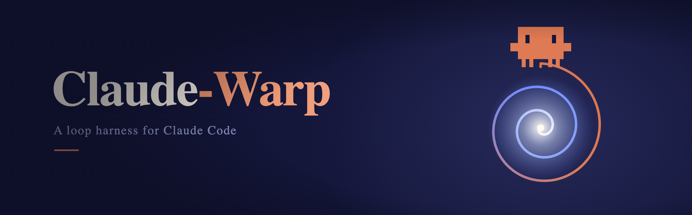

<p align="center">
  
</p>

<h1 align="center">ClaudeWarp</h1>

<p align="center">
  <em><b>Outlives the session. Answers with evidence.</b></em><br>
  <em>The loop harness for Claude Code — scaffold, guard, and schedule autonomous tasks in any project.</em>
</p>

<p align="center">
  <a href="https://github.com/lucagattoni/Claude-Warp/actions/workflows/verify.yml"></a>
  <a href="https://scorecard.dev/viewer/?uri=github.com/lucagattoni/Claude-Warp"></a>
</p>

<p align="center">
  📖 <strong><a href="https://lucagattoni.github.io/Claude-Warp/">Read the docs</a></strong> — the same pages, as a searchable 3-column site.
</p>

**Autonomous agents fail in two ways: they stop when you leave, and they say "done" when it isn't.**  
**ClaudeWarp fixes both, on top of Claude Code.**

**Work that outlives the session.**  
Native `/goal` dies with the terminal, `/loop` expires after
seven days, a dynamic workflow restarts from zero if the session exits.  
ClaudeWarp keeps state in
git — goals, loops, and multi-stage task queues that survive a crash, a reboot, or a different
machine picking up where the last one stopped — and runs them from plain cron: no open session,
no daemon, no cloud required.

**"Done" that comes with evidence.**  
Merge-gated work is graded by an independent checker — a
different model at higher risk tiers. An unrun check is reported `not run`, never green. A
blocking finding must reproduce before it blocks, and a lone green is labeled `uncorroborated`,
not trusted. When the agent is unsure, it says `done_with_concerns` — a status, not a rounding-up.

Every scaffold carries a hard budget and turn cap.  
And the harness is built to disappear: `/claude-warp-sync` reads every Claude Code release and
retires each component the moment it ships natively.

---

## From contractor to employee

Claude Code gives you a brilliant contractor — superb while engaged, gone when the session ends.
ClaudeWarp is the paperwork that turns that contractor into staff:

- **A job description.** [`/claude-warp-contract`](docs/concepts.md) turns "improve X" into a
  verifiable spec — scope, trigger, budget, and a stopping condition that is a command, not a
  vibe. An underspecified goal is stopped at the [G0–G3 gate](docs/goal-readiness.md) before it
  burns a token.
- **A spending limit.** Hard `$` and turn caps on every scaffold, and risk-scaled autonomy —
  report-only until a loop has earned the right to write.
- **A manager who checks the work.** Independent, skeptical review: cross-model checkers,
  corroboration before a pass counts, and every verdict names what it did **not** verify.
  → [the reviewer system](docs/reference/architecture.md#the-reviewer-system)
- **Honest status reports.** `done_with_concerns` / `needs_context` / `blocked` instead of
  rounding "unsure" up to done — plus a queryable cross-session ledger and retrospectives.
- **A role designed to shrink.** [`/claude-warp-sync`](docs/reference/skills.md) retires whatever
  Claude Code absorbs. The plumbing shrinks; the method deepens.
  → [the two directions](docs/reference/architecture.md#native-vs-harness)

## What you get over native

| You want | Native Claude Code gets you | ClaudeWarp adds |
|---|---|---|
| Run until done | `/goal` — independent per-turn evaluator, but it dies with the session and has no cap of its own | durable `GOAL.md` state, the G0–G3 readiness gate, hard `$`/turn caps — and the runner still delegates to `/goal` |
| Recur unattended | `/loop` — needs an open session, expires after 7 days | crontab/launchd triggers, duplicate-run guards, cross-run state with dedup |
| Big multi-stage jobs | `/batch` / dynamic workflows — restart fresh if the session exits | git-recoverable task queue, dependency waves, mandatory QA gates on merge-gated work |
| Trust the verdict | `/code-review` on a diff | cross-model checkers, reproduction-required corroboration, honest statuses, a release-readiness gate |

→ Full skill-by-skill comparison: **[ClaudeWarp vs Native Claude Code](docs/reference/comparison.md)**

ClaudeWarp is intentionally thin: every scaffolder routes to the native feature first — and says
so and stops when native alone is enough.

---

## Pick your path

| | Start here |
|---|---|
| 🐣 **New to this?** | **[Quick start](docs/quickstart.md)** — run your first autonomous task in 10 minutes, zero prior knowledge assumed. Then [Concepts](docs/concepts.md) for the "why". |
| 🚀 **Claude Code veteran?** | Skip the intro → **[vs native Claude Code](docs/reference/comparison.md)** (what this actually adds) · [Skills reference](docs/reference/skills.md) (all 15, in depth) · [Architecture](docs/reference/architecture.md) · [Developing](docs/reference/developing.md). The function table below is your map. |

---

## Install

**Prerequisites:** Claude Code installed, and a git repository as your working directory.

**Option A — curl installer** (also runs project setup):

```bash
bash <(curl -fsSL https://raw.githubusercontent.com/lucagattoni/Claude-Warp/main/install.sh)
```

Runs `/claude-warp-setup` autonomously: detects your project type, fills `CLAUDE.md` and
`harness-manifest.json`, installs all skills under `.claude/skills/`, and commits.

**Option B — Claude Code plugin** (skills available everywhere, namespaced):

```bash
/plugin marketplace add lucagattoni/Claude-Warp
/plugin install claude-warp@claude-warp
```

Then run `/claude-warp:claude-warp-setup` in a project to materialise `CLAUDE.md` +
`harness-manifest.json`. → Full guide: **[docs/install.md](docs/install.md)**

---

## Skills

`/claude-warp-contract` is the one door — describe anything and it routes to the right scaffold. The
rest you can also invoke directly.

| Skill | What it does |
|---|---|
| `/claude-warp-setup` | Per-project installer |
| `/claude-warp-contract "goal"` | **Start here** — the single adaptive entry: negotiate a [plan](docs/concepts.md), auto-route to its shape (single-shot / loop / harness), and hand off to the scaffolder. Scales questions to complexity |
| `/claude-warp-new-loop "goal"` | Scaffold a recurring single-agent loop or fan-out loop |
| `/claude-warp-new-goal "goal"` | Scaffold a one-shot bounded goal that runs once and stops at a verifiable criterion |
| `/claude-warp-new-harness "goal"` | Scaffold a two-part harness for large multi-stage goals |
| `/claude-warp-converge` | Reconcile the actual repo state against contract + task intent, classify gaps (missing/partial/contradicts/unrequested), and append-only re-ticket the unmet pieces (read-only; idempotent) |
| `/claude-warp-release` | Release-readiness gate distinct from "done"/"merged" — packages evidence and emits a two-tier verdict (BLOCK on mechanical boundaries: VERSION/CHANGELOG/tag/`[Unreleased]`/dirty tree; WARN+Surface on the bump-severity judgment). Read-only; prints the tag/release commands, never runs them |
| `/claude-warp-new-agent "role"` | Scaffold a specialized subagent in `.claude/agents/` |
| `/claude-warp-new-hook "description"` | Scaffold a hook (9 patterns): verify-before-stop, destructive-block, audit-log, subagent-chain, security-scan, evidence-gate, review-gate, kill-switch, steer |
| `/claude-warp-inventory` | Self-inspect installed skills, agents, hooks, loops — report versions and health issues |
| `/claude-warp-retro "slug"` | Retrospective on a loop — what worked, what failed, top 3 improvements; writes RETRO.md |
| `/claude-warp-ledger` | Persistent cross-session closure ledger — `record`/`query` closure events (shipped/surfaced/converged) in append-only `.claudewarp/ledger.jsonl`; the queryable "what happened, in order" that survives across sessions (over executable `scripts/ledger.sh`) |
| `/claude-warp-sync` | Prune harness components superseded by Claude Code |
| `/claude-warp-update` | Pull the latest ClaudeWarp skills from GitHub |
| `/claude-warp-sync-research` | Scan Claude-Loops and GitHub for new patterns; implement findings automatically |

---

## Docs

| Document | Contents |
|---|---|
| [docs/quickstart.md](docs/quickstart.md) | **🐣 Start here** — your first autonomous task in 10 minutes (goal, then loop) |
| [docs/concepts.md](docs/concepts.md) | The model — plans, shapes (goal/loop/harness), and `/claude-warp-contract` |
| [docs/install.md](docs/install.md) | Prerequisites, install command, verification, update, uninstall |
| [docs/goal-readiness.md](docs/goal-readiness.md) | G0–G3 readiness scale — how to specify goals so agents know when they're done |
| **How-to guides** | [scaffolding](docs/guides/scaffolding.md) · [scheduling](docs/guides/scheduling.md) · [deployment posture](docs/guides/deployment.md) · [monitoring](docs/guides/monitoring.md) · [iterating](docs/guides/iterating.md) |
| **Reference** (🚀) | [vs native Claude Code](docs/reference/comparison.md) · [skills](docs/reference/skills.md) · [templates](docs/reference/templates.md) · [architecture](docs/reference/architecture.md) · [developing](docs/reference/developing.md) |

---

## Companion

[ClaudeLoops](https://lucagattoni.github.io/Claude-Loops/) is the knowledge base behind ClaudeWarp —
loop engineering patterns, failure modes, and building blocks.

---

## Notes

- **One model, three shapes.** A *plan* is what you want done; *goal* / *loop* / *harness* are the
  shapes it can take (small / recurring / big). You don't pick by hand — `/claude-warp-contract` does.
  → [the full model](docs/concepts.md).
- **Working on ClaudeWarp itself?** `scripts/dev.sh selfhost` symlinks the skills as live commands and
  `scripts/dev.sh verify` runs the deterministic CI checks. → [Developing](docs/reference/developing.md).
